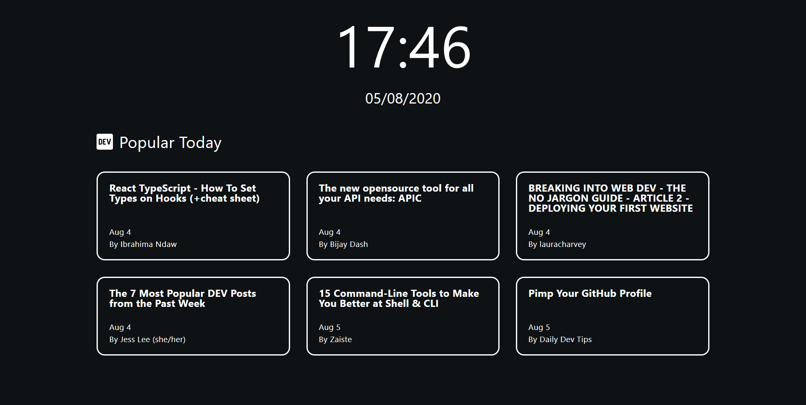

## Browser Home Page

This is a simple home page to use in your browser. It shows latest hot posts on dev.to



## To use
To use just download the page from the **build** folder and set it as your browser home page.

## For development:
- Install dependencies:
```
npm install
```

- Run dev command (it compiles the files, run the browserSync server and watches for changes to recompile and reload browser automatically)
```
npm run dev
```

### Compile
To just compile and build the files (it will generate the build and dest folders):
```
npm run build
```